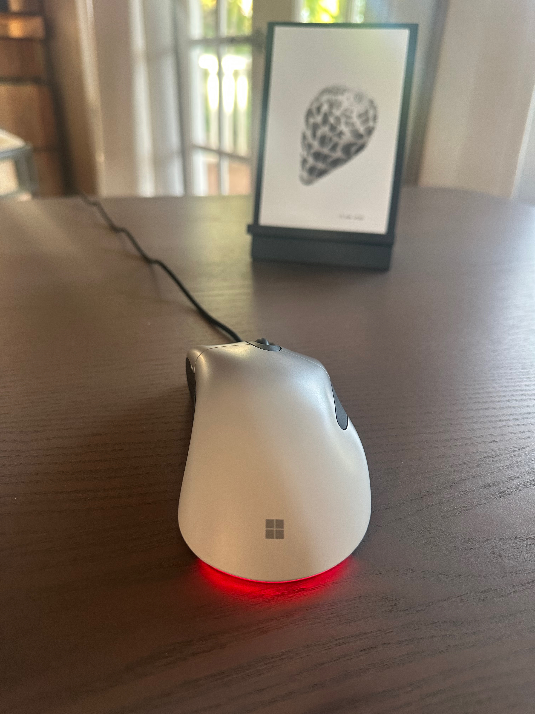

# TailLight

macOS utility for setting the light on the Microsoft Pro IntelliMouse.

## License

TailLight is licensed under the MIT License (see [LICENSE](LICENSE)). It depends on the following separately licensed third-party libraries and components:

- [Diligence](https://github.com/inseven/diligence), MIT License
- [Glitter](https://github.com/inseven/glitter), MIT License
- [Licensable](https://github.com/inseven/licensable), MIT License
- [Sparkle](https://github.com/sparkle-project/Sparkle), Sparkle License
